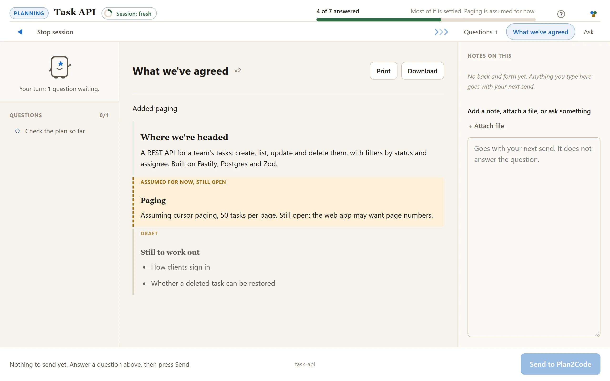
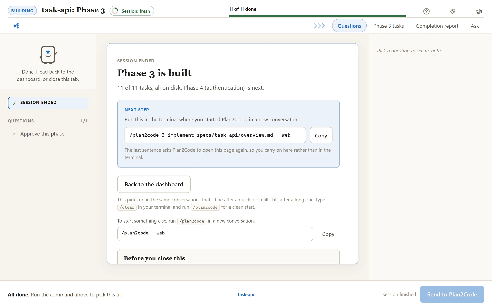

# Walkthrough: one feature, start to finish

A REST API for task management goes from a sentence to archived specs, all on the web console.
Each session stays short, and the specs on disk carry everything from one session to the next.

← [Back to README](../README.md)

---

## Session 1: Plan

Run `plan2code` in the project (or `/plan2code` inside your agent). The dashboard opens in your
browser with every step laid out as a card.

<picture>
  <source media="(prefers-color-scheme: dark)" srcset="../docs/screenshots/dashboard-dark.webp">
  
</picture>

Pick **Plan** and describe the idea in the box: *I want to build a REST API for a task management
application.* The same page turns into the Plan session.

The questions arrive in batches of up to three, each option with its trade-off written underneath.
Answer what is there and press **Send to Plan2Code**; the next batch follows.

<picture>
  <source media="(prefers-color-scheme: dark)" srcset="../docs/screenshots/question-dark.webp">
  
</picture>

The phase breakdown comes back as a list you can reorder and edit. Documents a skill writes on the
page open as tabs like this one, where settled parts read as decisions and anything still a guess
is marked as assumed and still open.

<picture>
  <source media="(prefers-color-scheme: dark)" srcset="../docs/screenshots/doc-dark.webp">
  
</picture>

Plan proposes a tech stack, Fastify + Postgres + Zod, and does not pick it alone: a sign-off card
asks you to approve it. Plan then designs the architecture. At 92% confidence (the gate is 90%) it
asks whether to write the draft, and with 3 assumptions written down, it writes:

```
specs/task-api/PLAN-DRAFT-20260804.md
```

Two files land: the draft, and a `PLAN-CONVERSATION-*.md` log of how you got there. The finish
card names the next step.

> **Started foggy instead?** Run `/plan2code-0-pathfinder` first. When its map clears it writes a
> `PLAN-DRAFT` that Plan picks up at Phase 4, with requirements and scope already answered.

---

## Session 2: Document

On Plan's finish card, press **Back to the dashboard** (or start a fresh console session if the
session meter says so; see Session 3 below). Pick **Document**, with `specs/task-api` selected in
the picker at the top. It reads `specs/task-api/PLAN-DRAFT-20260804.md`.

The overview and each phase file appear as tabs as they are written, so you watch the spec take
shape:

```
specs/task-api/overview.md
specs/task-api/phase-1.md   Project setup           (6 tasks)
specs/task-api/phase-2.md   Data model              (8 tasks)
specs/task-api/phase-3.md   API endpoints          (11 tasks)
specs/task-api/phase-4.md   Authentication          (7 tasks)
```

Parallel execution groups: Phase 3 and Phase 4 don't share files.

---

## Sessions 3 to N: Implement, one phase each

Look at the session meter in the top bar first. Plan and Document add 2 points each, so after
those two the meter is at 4: **Session: getting long**, in yellow. That is the cue to close this
console session and start a fresh one for the build (run `plan2code` again). This is the first of
the four rules:

> **1 · Keep each session short.**
> Chaining a couple of small skills on the dashboard is fine. Start a fresh console session when the session meter turns red, and always before a big planning or build step. The specs on disk carry everything between sessions.

On the fresh dashboard, pick **Implement** for `specs/task-api`. Phase 1 (Project setup) is the next
unchecked phase, so it starts there. The page shows the build as it goes: a progress bar counting
tasks, the phase's task list ticking as each task lands on disk, and a line beside Planny saying
what it is doing now. Use the **Ask** tab for a quick question without interrupting the build.

<picture>
  <source media="(prefers-color-scheme: dark)" srcset="../docs/screenshots/build-dark.webp">
  
</picture>

When all 6 of 6 tasks are ticked in `phase-1.md`, a **Completion report** tab opens with the
sign-off card: **Review the code first**, **Approve this phase**, or **I want changes**.

<picture>
  <source media="(prefers-color-scheme: dark)" srcset="../docs/screenshots/signoff-dark.webp">
  
</picture>

After you approve, `overview.md` marks Phase 1 done, and the finish card gives the next command:
Phase 2, Data model (8 tasks), in a new session.

<picture>
  <source media="(prefers-color-scheme: dark)" srcset="../docs/screenshots/finish-dark.webp">
  
</picture>

Repeat. A fresh session each time. It always finds the next open phase itself.

When you reach a parallel group, it offers you the choice: open a second agent, take the other
phase, and the `[/]` marks keep them from colliding.

Pick **Implement + review** instead when review should run automatically before phase approval.
**Review** remains available on the dashboard for an independent second opinion at any other time.

---

## Final session: Finalize

With every phase approved, the dashboard suggests **Finalize** for `specs/task-api`. Pick it in a
fresh session. Each check lands on the page as a report tab, and anything that needs your say is
a card:

- **Validation.** All 32 tasks verified against the phase specs. 2 gaps found and fixed.
- **Documentation review.** README needs the new `/tasks` endpoints; AGENTS.md is current. A card
  lists the proposed doc updates, and you tick the ones to make.
- **Spec cleanup.** A confirm card, then `specs/task-api/` moves to `specs--completed/task-api/`.

The finish card says the implementation is complete, and gives the commit command when doc
updates landed.

---

## If requirements move mid-build

Don't patch the code and hope the specs catch up. Pick **Revise the plan** on the dashboard: it
edits the specs (and only the specs), so the drawing and the build stay in agreement.

---

## Prefer the terminal?

The same journey is four commands, each in a new conversation:

1. `/plan2code-1-plan` with the idea in a sentence. Writes `specs/task-api/PLAN-DRAFT-20260804.md`.
2. `/plan2code-2-document specs/task-api/PLAN-DRAFT-20260804.md`. Writes the overview and phase files.
3. `/plan2code-3-implement specs/task-api/overview.md`, once per phase. It finds the next open phase itself.
4. `/plan2code-4-finalize specs/task-api/overview.md`. Verifies, updates docs, and archives the spec.

Add `--web` to any of them (for example `/plan2code-1-plan --web`) to open that step straight on the
web console without being asked. Every command and argument is in the README's
[Prefer the terminal?](../README.md#prefer-the-terminal) section. You can switch between terminal and
console at any point, because the files under `specs/` are the only state.

## More

- [web-console.md](web-console.md): every screen, setting and recovery path
- [../QUICK-REFERENCE.md](../QUICK-REFERENCE.md): the one-page card
