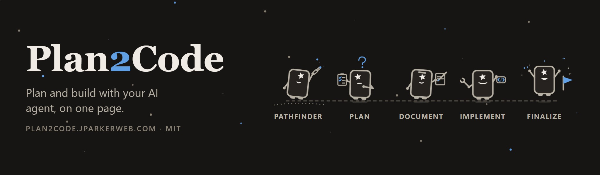
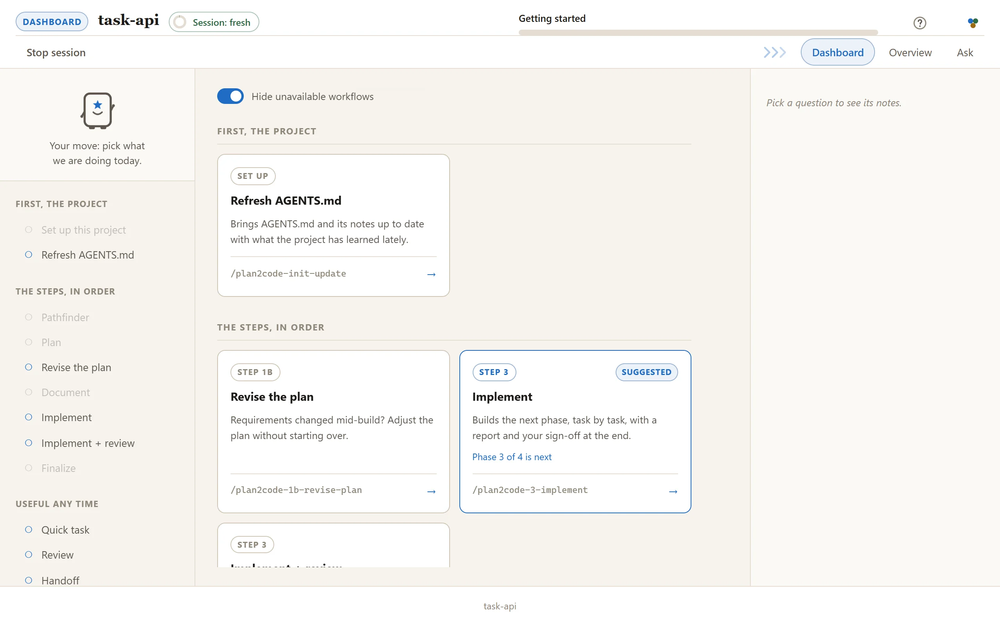
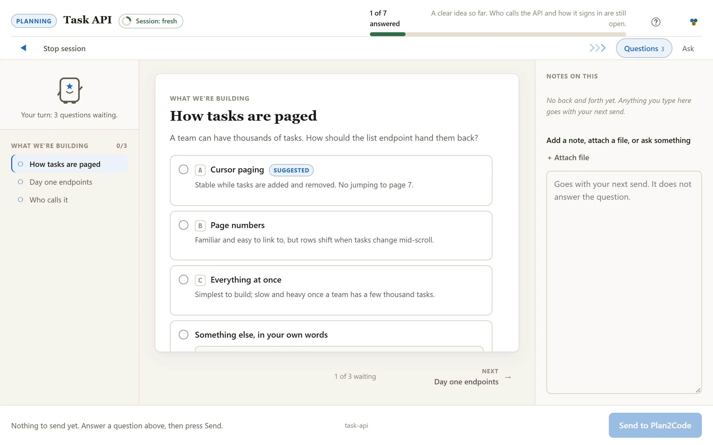
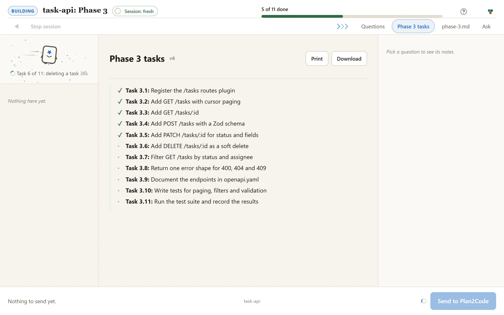
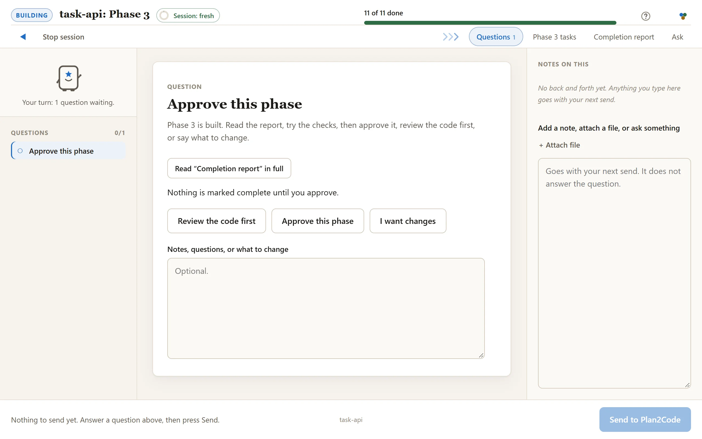
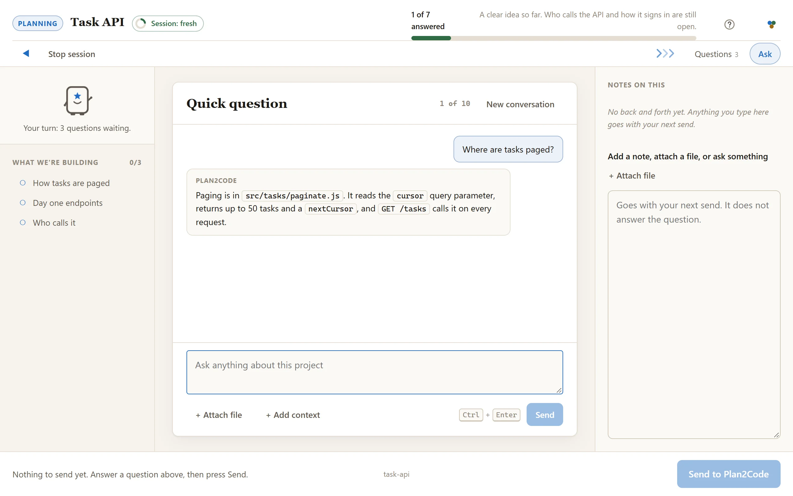

# Plan2Code

**A spec-driven workflow for AI coding agents.**



You work through Plan2Code on a page in your browser. The dashboard lists every step as a card, and
each step's questions, progress and sign-offs arrive on that same page while your agent does the
work. What you decide still lands in your repo as plain files: an approved plan becomes phase
documents, and the agent builds to them one phase at a time, so the next session, the next agent and
the next engineer all start from the same specs.

One command opens it, every step is a card, and the terminal is always there if you prefer it.

Version 2.6.0 · MIT · 📖 [plan2code.jparkerweb.com](https://plan2code.jparkerweb.com)

---

## See it

<picture>
  <source media="(prefers-color-scheme: dark)" srcset="docs/screenshots/dashboard-dark.webp">
  
</picture>

The dashboard, in a project halfway through a build. It suggests the next step for the spec you pick.

---

## Install and start

Requires [Node.js](https://nodejs.org/) 18 or later and network access — installation runs through
the [skills CLI](https://skills.sh). To update, re-run the install command.

```bash
npx --allow-git=all git+https://github.com/jparkerweb/plan2code.git
```

This fetches the installer to a temp directory, builds the workflow as Agent Skills, delegates
installation to `skills add`, and cleans up after itself. The installed skills work independently
from then on.

The installer opens this menu (cloning and running `node install.js`, below, opens the same one):

```
╔═════════════════════════════════════════════════════════╗
║ INSTALL PLAN2CODE                                       ║
╠═════════════════════════════════════════════════════════╣
║  I.  INSTALL    Install Plan2Code skills everywhere     ║
║  A.  ALL        Install Plan2Code + dev tools           ║
║  U.  UNINSTALL  Remove Plan2Code skills and dev tools   ║
║  C.  CUSTOM     Advanced options                        ║
║  Q.  QUIT       Exit                                    ║
╚═════════════════════════════════════════════════════════╝
```

### Start

1. In any project, run `plan2code`. It starts Claude Code or Devin on the dashboard, and the
   dashboard opens in your browser.
2. In a project without an `AGENTS.md`, pick **Set up this project** first: Plan and Quick task
   need it.
3. Pick a card.

Already inside your agent? Type `/plan2code` instead.

<details>
<summary>About the plan2code command</summary>

The installer adds `plan2code` as a global command (Custom `C` → `D` adds just the command). Run it from any project and the Plan2Code
dashboard opens right there, in **Claude Code** or **Devin**. With both installed it asks which and
remembers your pick; `plan2code --cli claude` or `--cli devin` skips the question, and `--model <name>`
chooses the model. It works in cmd, PowerShell, Git Bash, macOS and Linux shells, and needs the
Claude Code or Devin CLI on your `PATH`. It starts the agent with permission prompts off
(`--permission-mode bypassPermissions` in Claude Code, `--permission-mode bypass` in Devin); run
`claude /plan2code` yourself if you want prompts. The installer then offers a desktop shortcut (answer `y`),
which opens a folder picker first. Uninstalling (`U`) removes both.
</details>

**Supported tools:** every agent supported by the skills CLI, including Claude Code · Cursor ·
GitHub Copilot · Windsurf · Codex · Continue · Codeium · Zed · Amp · OpenCode · Devin · Crush · Pi ·
Gemini CLI · Cline · Roo · Kilo · Goose · Trae · Qwen Code.

The installer keeps one canonical copy of each skill under `~/.agents/skills/` and links it into
agents that maintain their own directory. To update, re-run the install command.

Use the installer rather than calling `skills add` against the repository root: recursive discovery
would also find maintainer-only skills under `.claude/skills/`. The installer targets `skills/`
explicitly.

<details>
<summary>Prefer to clone?</summary>

```bash
git clone https://github.com/jparkerweb/plan2code.git
cd plan2code
node install.js

# Only if you plan to modify or contribute to Plan2Code itself
npm install && npx husky
```
</details>

---

## A session on the page

**Answer the questions.** They arrive a few at a time, each option with its trade-off written beside
it, and a progress bar says how far along you are.

<picture>
  <source media="(prefers-color-scheme: dark)" srcset="docs/screenshots/question-dark.webp">
  
</picture>

**Watch the build.** Tasks tick off as they land, and the line beside Planny says what is being
worked on right now.

<picture>
  <source media="(prefers-color-scheme: dark)" srcset="docs/screenshots/build-dark.webp">
  
</picture>

**Sign off.** Read the completion report, then approve the phase or ask for changes. In Implement,
you can also have the code reviewed first; Implement + review has already done it.

<picture>
  <source media="(prefers-color-scheme: dark)" srcset="docs/screenshots/signoff-dark.webp">
  
</picture>

**Ask a quick question any time.** The Ask tab is a chat beside the cards, answered at the agent's
next check-in, and it never holds up your answers.

<picture>
  <source media="(prefers-color-scheme: dark)" srcset="docs/screenshots/ask-dark.webp">
  
</picture>

There is more on the page when you need it. Notes on any question can carry screenshots and
documents. The folder label in the bottom bar opens your workspace, where you add other folders
as read-only context and point at them by `@name`. The session meter in the top bar turns from green
to red as a session grows long and suggests a fresh one. **Stop session** saves your place and gives
you the command to carry on later, and **Back to the dashboard** takes you home to pick the next
step in the same session.

---

## The workflow

```
 ┌╴╴╴╴╴╴╴╴╴╴╴╴┐
 ╎0 PATHFINDER╎ optional · for an idea too big or unclear to plan
 └╴╴╴╴╴╴┬╴╴╴╴╴┘
        ▼
 ┌────────────┐  ┌────────────┐  ┌────────────┐  ┌╴╴╴╴╴╴╴╴╴╴╴╴┐  ┌────────────┐
 │  1  PLAN   │─>│ 2 DOCUMENT │─>│3 IMPLEMENT │─>╎   REVIEW   ╎─>│ 4 FINALIZE │
 │decide what │  │ draw it as │  │build to the│  ╎  optional  ╎  │verify, sum,│
 │  to build  │  │phase specs │  │  drawing   │  ╎  any time  ╎  │  archive   │
 └────────────┘  └────────────┘  └────────────┘  └╴╴╴╴╴╴╴╴╴╴╴╴┘  └────────────┘
     short sessions: fresh when the meter turns red, and before a big step
 ├◀─────────────── one feature, start to archive ──────────────────▶┤
```

Each box is a card on the dashboard. Chaining a couple of small steps in one session is fine, but
start a fresh session before a big plan or build step: planning context leaking into implementation
is where most agent drift starts.

The dashboard's cards, and when each one lights up for the spec you pick:

| Card | What it is for | Lights up when |
|------|----------------|----------------|
| Set up this project | Reads your project and writes AGENTS.md, the guide every later step works from. | The project has no AGENTS.md yet |
| Refresh AGENTS.md | Brings AGENTS.md and its notes up to date with what the project has learned lately. | The project has an AGENTS.md |
| Pathfinder | A foggy idea becomes a clear list of decisions, settled one question at a time. | You start fresh, or the spec is still being explored |
| Plan | Requirements, technical design and your approval: the shape of what gets built. | You start fresh, or the spec has a finished Pathfinder map or a drafted plan |
| Revise the plan | Requirements changed mid-build? Adjust the plan without starting over. | The spec is written up into phases and not fully built |
| Document | The plan becomes a checklist of small tasks, grouped into phases, that a developer can just do. | The spec has a drafted plan |
| Implement | Builds the next phase, task by task, with a report and your sign-off at the end. | The spec has phases with tasks still to build |
| Implement + review | One phase built, then a careful review of the changes, then your sign-off. All in one run. | The spec has phases with tasks still to build |
| Finalize | Checks the work, writes the summary, files the specs away and suggests the commit message. | Every task in the spec is done |
| Quick task | Too small for the full process? A quick plan, then it just builds it. | Always |
| Review | A second opinion on the changes. Problems ranked, and you pick what gets fixed. | Always |
| Handoff | Pack this conversation into a document a fresh session can pick up cold. | Always |
| Git commit | Commits your changes with a clear message, suggests a split when it is really two jobs, and offers to push. | Always (offers to start a repository outside one) |

---

## The four rules that do most of the work

**1 · Keep each session short.**
Chaining a couple of small skills on the dashboard is fine. Start a fresh console session when the session meter turns red, and always before a big planning or build step. The specs on disk carry everything between sessions.

**2 · No code until the plan hits 90% confidence.**
Step 1 will not finalize below the threshold. Under it, the agent keeps asking and keeps reading your
code — and writes every assumption down where you can argue with it.

**3 · Checkboxes are the state, not the chat.**
Progress lives in the spec files. Any agent, any session, resumes cold from them.

**4 · Approve a phase to close it.**
On the sign-off card, or by replying `approved` in the terminal. Nothing advances on a guess about
what you meant.

---

## What lands in your repo

Each feature gets a folder under `specs/` (the plan, the overview and one file per phase), and Step 4
moves it to `specs--completed/`. The layout and progress marks are on the
[quick reference](QUICK-REFERENCE.md#file-structure).

Add `specs/` to your project's `.gitignore` (`plan2code-loop` adds it for you): it's your working
drawing, not a deliverable. Share a folder deliberately with `git add -f` when you want to.

Step 2 marks which phases don't share files. Open a second agent on one of those, and the `[/]` marks
keep the two out of each other's way.

---

## The six steps in detail

Each step is its own run, and the specs on disk are the only thing carried from one to the next.
Chain a small one onto the last, or start a fresh session for a big one (rule 1).

### 0 · Pathfinder 🧭 (optional)

On the page: one question at a time with the options and their trade-offs, the map growing in its own
tab, and a **Write a brief** button for a printable summary.

Some ideas are too big and unclear to plan: you can feel the shape of the work but you can't write
it as requirements, so planning would just invent the answers. Pathfinder finds the *way* to the
destination; Step 1 then walks it.

1. **Name the destination** — one or two lines fixing what this effort is finding its way to. Settled
   first, because it fixes scope. It also asks where the map should live: **local files** under
   gitignored `specs/` (private, solo — the default), or **GitHub Issues** (a map issue with one
   sub-issue per decision, native blocking, so your team can see and work the frontier in the tracker).
2. **Chart the map** — a breadth-first grilling surfaces the open decisions. Anything you can phrase
   *sharply* becomes a question file; anything you can only sense stays listed as fog.
3. **Clear the questions one at a time** — resolving one burns off the fog behind it, graduating
   whatever just became sharp into new questions. After each decision it offers a menu: take the next
   question here, or start fresh — recommended after about three, to keep the agent sharp.
   Ask for a **brief** at any point and you get a dated, plain-English summary of what has been
   decided, what is still open, and what is next — meeting minutes, with no jargon in them.
4. **Hand off** — when nothing is left to decide, it writes a `PLAN-DRAFT` that
   `/plan2code-1-plan` resumes from at Phase 4, with requirements, context, and scope already
   answered.

**Question types:** `grill` (a decision only you can make — the default) · `research` (a fact gates
it; background agents resolve these, several in parallel) · `sketch` (you need something concrete to
react to) · `legwork` (manual work that has to happen before a decision is possible).

It never answers its own questions, and it **plans, it never builds.** When the urge to just build it
arrives, the map is done. Skip Step 0 entirely when you already know what you're building.

**Out:** `specs/<feature>/pathfinder/map.md` + `questions/` (or a `pathfinder:map` issue and its
sub-issues) → `PLAN-DRAFT-<date>.md`. The draft is always a local file — that is what Step 1 reads.

### 1 · Plan 🤔

On the page: questions in batches of up to three, the phase breakdown as a list you can reorder and
edit, and a sign-off at each stage.

The agent works as a senior architect through seven phases, stopping for you after each: requirements
analysis · system context (reading your actual codebase) · scope assessment (a large project saves and
resumes in a fresh session) · tech stack (needs your explicit sign-off) · architecture design ·
technical specification · transition decision.

It won't finalize below **90% confidence**, and every assumption it makes is written into the draft.

**In:** a description of the feature. **Out:** `PLAN-DRAFT-<date>.md` + `PLAN-CONVERSATION-<date>.md`

### 2 · Document 📝

On the page: a question only where the plan leaves something open, each phase file appearing as its
own tab as it is written, and one sign-off at the end.

The plan becomes the drawing. One `overview.md` with the phase checklist, plus one file per phase of
one-story-point tasks. Each phase is **self-contained** — an agent opening `phase-3.md` cold needs
nothing else to build it. Unit and E2E tests are excluded unless you ask for them.

The overview also identifies the **parallel execution groups**: phases with no shared files or
dependencies, safe to run in separate agents at once.

**In:** the `PLAN-DRAFT`. **Out:** `overview.md` + `phase-1…N.md`

### 3 · Implement ⚡

On the page: a progress bar and the phase's task list ticking over as tasks land, then the completion
report and a sign-off card where you approve, ask for changes, or have the code reviewed first.

Point it at `overview.md` and it does the rest: finds the next unchecked phase, implements every task
exactly as specified, ticks tasks off as they land, then reviews its own work against the spec and
writes a completion summary.

One phase per conversation. It won't run tests unless the phase says to.

**In:** `specs/<feature>/overview.md`. **Out:** working code, and updated checkboxes.

Want a second pair of eyes before you sign off? `/plan2code-3-implement-review` builds the phase the
same way, runs a focused review and the fixes you pick, and only then asks for approval.

### Review 🔬 — optional, any time

On the page: a few questions on scope, the findings as a report you can read in full, and a list
where you tick what gets fixed.

An independent second opinion, not a rubber stamp. It figures out its own scope (conversation
context, your instruction, or the git diff as a fallback), analyses across 11 dimensions, and ranks
findings Critical / Warning / Suggestion. Every finding cites a file and a line, or it gets dropped —
and the review pass is read-only. It fixes things only if you ask, and verifies each fix afterwards.

Spec-aware when `specs/` exists, and works fine without it. Most useful right after a planning or
implementation step, but there's no wrong time to run it.

### 4 · Finalize 🧹

On the page: the task audit and the summary as reports, a list of the doc updates to approve, and a
confirmation before anything is archived.

Validates every task against its phase spec, writes the summary and the list of files touched, flags
the docs that drifted (`README`, `CHANGELOG`, `AGENTS.md`), then archives the whole spec folder —
`pathfinder/` included — to `specs--completed/`. That folder is the record of *why* the code looks
like this.

**In:** `specs/<feature>/overview.md`. **Out:** archived specs.

---

## Prefer the terminal?

Every skill also runs right in the terminal. Each one asks at the start whether you want the web
console or the terminal; add `--web` to skip the question and go straight to the web console:
`/plan2code-1-plan --web plan a REST API for tasks`.

| Command | Use it when |
|---------|-------------|
| `/plan2code` | Open the dashboard in the web console: every skill below as a card, launched on the page |
| `/plan2code-0-pathfinder` | The idea is too big and unclear to plan. Charts it as decisions, clears them one at a time, hands a hot plan draft to Step 1 |
| `/plan2code-1-plan` | Starting a feature. Full requirements → architecture pass |
| `/plan2code-2-document` | Planning is done. Turn the plan into phase specs |
| `/plan2code-3-implement` | Build the next phase (one per conversation) |
| `/plan2code-3-implement-review` | Build the next phase and review it before you approve it (instead of `/plan2code-3-implement`) |
| `/plan2code-review` | Independent second opinion on local changes, then optional fixes |
| `/plan2code-4-finalize` | All phases done. Validate, summarize, archive |
| `/plan2code-init` | Generate this repo's `AGENTS.md` so every agent starts informed |
| `/plan2code-init-update` | Fold what you learned this session back into `AGENTS.md` |
| `/plan2code-quick-task` | A small change that doesn't warrant the full sequence |
| `/plan2code-1b-revise-plan` | Requirements moved mid-build. Revise the specs, not the code |
| `/plan2code-handoff` | Compact this conversation into a doc the next one resumes from |
| `/plan2code-git-commit` | Commit with a clear message, suggested splits, a branch offer on the default branch, and an optional push |

---

## Troubleshooting

**The skills aren't recognised.** Re-run the installer and restart your AI tool. Confirm the global
install with `npx skills list -g`. For a project install, check the generated directories aren't
gitignored.

**Your tool doesn't read Agent Skills.** Since v2.2.0, Plan2Code ships only as skills. If your tool
has no skill support, paste the relevant `src/plan2code-*.md` manually or point it at the installed
copy under `~/.agents/skills/`.

**The agent starts coding during planning.** The prompts forbid it, but models drift. Say: "Stay in
planning mode. Do not write code yet."

**The agent doesn't know what to implement.** Give it the path to `overview.md` — it reads the phase
file itself from there.

**You lost track between sessions.** `overview.md` has the phase status; the phase files have the
task status. That's the whole state.

**The agent isn't following the spec.** Point at the specific phase document and tell it to re-read
the requirements.

**Too many or too few phases.** Fix it in Step 2 — a phase should be a logical grouping of work, not
a fixed size.

**The agent runs on another machine, or over SSH.** The page is served on `127.0.0.1` of the machine
the agent runs on, so your browser can only reach it there. A forwarded port often works; otherwise
work in the terminal, which loses nothing.

**Web console problems** (lost contact, a closed tab, a dead link): see
[.readme/web-console.md](.readme/web-console.md#troubleshooting).

---

## Customizing

The prompts are yours to edit. Common changes: add testing requirements in Step 2, move the 90%
confidence threshold in Step 1, restructure the `specs/` layout, or add review gates to Step 3.
Source files live in `src/`; run `npm run build:skills`, then re-run `node install.js` to push your
edits out through the skills CLI.

---

## Dive deeper

Core reference:

- **[.readme/web-console.md](.readme/web-console.md)**: the full guide to the web console, from the dashboard to the last sign-off
- **[QUICK-REFERENCE.md](QUICK-REFERENCE.md)** — the one-page card: commands, inputs, outputs, decision tree
- **[.readme/walkthrough.md](.readme/walkthrough.md)** — one feature from a sentence to archived specs, session by session
- **[AGENTS.md](AGENTS.md)** — architecture and contributor guide for this repo
- **[CHANGELOG.md](CHANGELOG.md)** — what changed, and why

Optional tooling — none of it is required to use the workflow:

- **[.readme/autonomous-loop.md](.readme/autonomous-loop.md)** — `plan2code-loop`, a hands-off alternative to Step 3
- **[.readme/status-line.md](.readme/status-line.md)** — three-line Claude Code status bar: model, context, quota, diff
- **[.readme/metrics.md](.readme/metrics.md)** — `plan2code-metrics`, measuring and improving the prompts themselves
- **[.readme/test-bot.md](.readme/test-bot.md)** — `plan2code-bot`, maintainer harness that runs the whole workflow unattended
