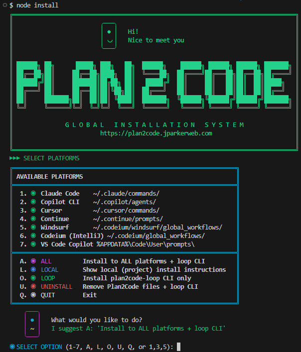

# Plan2Code: AI-Assisted Software Development Workflow

A structured 4-step workflow for developing features and projects with AI assistance. This methodology emphasizes thorough planning before implementation, ensuring well-documented, maintainable code.


## Overview

```
        🤔                     📝                     ⚡                     🧹
┌─────────────────┐     ┌─────────────────┐     ┌─────────────────┐     ┌─────────────────┐
│   Step 1        │     │   Step 2        │     │   Step 3        │     │   Step 4        │
│   PLAN          │ --> │   DOCUMENT      │ --> │   IMPLEMENT     │ --> │   FINALIZE      │
└─────────────────┘     └─────────────────┘     └─────────────────┘     └─────────────────┘
      New Chat               New Chat           New Chat (per phase)        New Chat
```

| Command                          | When to Use                                              |
|----------------------------------|----------------------------------------------------------|
| `/plan2code-init`            | Generate AGENTS.md file for new/existing projects        |
| `/plan2code-init-update`     | Update AGENTS.md with new learnings from coding sessions |
| `/plan2code-quick-task`      | Small, quick tasks that don't need full workflow         |
| `/plan2code-1-plan`           | Starting a new feature (full planning)                   |
| `/plan2code-1b-revise-plan`   | Requirements change mid-implementation                   |
| `/plan2code-2-document`       | After planning, create implementation specs              |
| `/plan2code-3-implement`      | Execute implementation (one phase per conversation)      |
| `/plan2code-3b-review`        | Post-phase code review (after key features or milestones)|
| `/plan2code-4-finalize`       | All phases complete, ready to archive                    |

**Key Rules:**
- Start NEW conversation for each step (and each implementation phase)
- ONE phase per conversation
- Reply "approved" to complete phases
- 90% confidence required before planning completes

See [QUICK-REFERENCE.md](QUICK-REFERENCE.md) for full reference card.

---

## Installation

Plan2Code includes an interactive installer that generates and installs workflow files for all major AI coding assistants.



### Prerequisites

The install script requires **Node.js** (v14 or later). If you don't have Node.js installed:

1. Download from [nodejs.org](https://nodejs.org/) (recommended)
2. Or use a package manager:
   - **macOS:** `brew install node`
   - **Windows:** `winget install OpenJS.NodeJS` or `choco install nodejs`
   - **Linux:** `sudo apt install nodejs` (Debian/Ubuntu) or `sudo dnf install nodejs` (Fedora)

### Supported Platforms

- Claude Code
- Cursor
- Windsurf
- Continue
- Codeium (IntelliJ)
- GitHub Copilot CLI
- VS Code GitHub Copilot
- Gemini CLI
- Crush
- Pi (pi.dev)
- Amp
- OpenCode
- Devin

### Install via npx (Recommended — No Clone Required)

Run the interactive installer directly using `npx` with your preferred GitHub authentication method:

**If you use SSH keys:**
```bash
npx git+ssh://git@github.com/jparkerweb/plan2code.git
```

**If you use HTTPS authentication:**
```bash
npx git+https://github.com/jparkerweb/plan2code.git
```

This downloads the installer to a temporary location, runs it, installs the workflow files to your machine, and cleans up automatically. The installed workflows remain on your system and work independently. To update or reinstall, simply run the command again.

### Standard Installation (Clone Method)

#### No Clone Required

Run the interactive installer directly using `npx` with your preferred GitHub authentication method:

**If you use SSH keys:**
```bash
npx git+ssh://git@github.com/jparkerweb/plan2code.git
```

**If you use HTTPS authentication:**
```bash
npx git+https://github.com/jparkerweb/plan2code.git
```

This downloads the installer to a temporary location, runs it, installs the workflow files to your machine, and cleans up automatically. The installed workflows remain on your system and work independently. To update or reinstall, simply run the command again.

#### Standard Installation (Clone Method)

```bash
# Clone the repository
git clone https://github.com/jparkerweb/plan2code.git
cd plan2code

# Run the interactive installer
node install.js

# OPTIONAL: Install dev dependencies (ONLY if you plan to modify/contribute to Plan2Code)
npm install
```

The installer displays an interactive menu:

```
╔════════════════════════════════════════════════════════════════╗
║ INSTALL PLAN2CODE                                            ║
╠════════════════════════════════════════════════════════════════╣
║  I.  INSTALL    Install Plan2Code for all platforms          ║
║  U.  UNINSTALL  Remove Plan2Code files                       ║
║  C.  CUSTOM     Advanced options                               ║
║  Q.  QUIT       Exit                                           ║
╚════════════════════════════════════════════════════════════════╝

SELECT OPTION (I, U, C, Q) [I]:
```

---

## Important: Start Fresh Conversations

**Start a new conversation/chat session before each step.** This includes:

- Step 1: New conversation
- Step 2: New conversation
- Step 3: New conversation **for each phase** (Phase 1, Phase 2, etc.)
- Step 4: New conversation

Fresh conversations prevent context pollution and ensure the AI focuses on the current task with the relevant specifications.

---

## The Workflow Steps

### Step 1: Planning Mode 🤔

**Purpose:** Thoroughly analyze requirements and design the solution architecture before writing any code.

**AI Role:** Senior software architect and technical product manager

**Phases (completed one at a time):**

1. **Requirements Analysis** - Extract functional/non-functional requirements, identify ambiguities
2. **System Context Examination** - Review existing codebase, identify integration points
3. **Tech Stack** - Recommend and confirm all technologies (requires user sign-off)
4. **Architecture Design** - Propose patterns, define components, design interfaces/schemas
5. **Technical Specification** - Break down implementation phases, identify risks
6. **Transition Decision** - Finalize plan when confidence reaches 90%+

**Output:** `specs/<feature-name>/PLAN-DRAFT-<date>.md` and `specs/<feature-name>/PLAN-CONVERSATION-<date>.md` (date format: YYYYMMDD)

**Key Behaviors:**

- AI stops after each phase for clarification
- Must reach 90% confidence before finalizing
- All assumptions are documented
- User must approve tech stack decisions

---

### Step 2: Documentation Mode 📝

**Purpose:** Transform the planning output into structured, actionable implementation documents.

**Required Context:** Attach or reference the `specs/<feature-name>/PLAN-DRAFT-<date>.md` from Step 1 (or provide the planning conversation).

**Output Structure:**

```
specs/
└── <feature-name>/
    ├── overview.md          # High-level overview with phase checkboxes and parallel groups
    ├── Phase 1.md           # Detailed tasks for Phase 1
    ├── Phase 2.md           # Detailed tasks for Phase 2
    └── Phase N.md           # ...additional phases
```

The `overview.md` includes a "Parallel Execution Groups" section that identifies which phases can be run simultaneously in separate agent instances.

**Document Format:**

- Each phase file contains detailed one-story-point tasks
- All tasks have checkboxes `[ ]` for progress tracking
- Each phase is self-contained (developer needs no prior context)
- Unit/E2E testing excluded unless explicitly requested

---

### Step 3: Implementation Mode ⚡

**Purpose:** Execute the implementation following the documented specifications.

**AI Role:** Senior software engineer

**Required Context:** Provide the path to `specs/<feature-name>/overview.md`. The command will auto-detect the next uncompleted phase and read the corresponding `Phase X.md` file automatically.

**Workflow:**

1. Identify the next uncompleted phase (unchecked in `overview.md`)
2. Check for parallel execution options (if phases can run simultaneously)
3. Implement ALL tasks in that phase exactly as specified
4. Update `Phase X.md` checkboxes as tasks complete `[x]`
5. Update `overview.md` phase checkbox when phase completes
6. Perform code review to ensure nothing was missed
7. Add completion summary to the phase document

**Parallel Execution:** If the next phase is part of a parallel-eligible group, you'll be prompted to choose which phase to implement. This allows running multiple agent instances simultaneously on different phases that don't conflict with each other.

**Key Rules:**

- **Start a new conversation for EACH phase**
- Work on ONE phase per conversation (unless told otherwise)
- Follow specifications EXACTLY as documented
- Keep checkboxes updated (enables progress tracking across sessions)
- Do NOT run tests unless specified in phase tasks

---

### Step 3b: Review Mode 🔬 (Optional)

**Purpose:** Comprehensive post-implementation code review with adaptive scope and spec compliance checking.

**AI Role:** Critical review specialist -- independent second opinion

**When to use:** After completing implementation phases, especially key features or milestones. Can be run after any phase, not just before finalization.

**What it does:**

1. Determines review scope — detects conversation context, user-specified scope, or gathers git changes as fallback
2. Understands context and determines review strategy
3. Analyzes across 11 dimensions (correctness, security, performance, spec compliance, etc.)
4. Generates findings ranked by severity (Critical, Warning, Suggestion)
5. Offers to fix issues, then provides commit guidance

**Key Behaviors:**

- Uses companion reference files for deep verification, detailed dimension checklists, and false-positive detection (loaded automatically during review)
- Reviews all changed files across 11 dimensions; prioritizes by risk when batches exceed 50 files
- Spec-aware when `specs/` exists; works standalone without specs
- Review phase is read-only; fixes only on user request with verification

---

### Step 4: Finalization Mode 🧹

**Purpose:** Validate implementation, create summaries, and archive documentation.

**Required Context:** Attach or reference the `specs/<feature-name>/` directory contents.

**Steps:**

1. **Validation** - Verify all tasks implemented correctly, check for issues
2. **Summary** - Document what was built and list all modified/created files
3. **Documentation Review** - Identify any needed README/CHANGELOG updates
4. **Spec Cleanup** - Move completed specs to `specs--completed/<implementation-name>/`
5. **Final Confirmation** - Confirm completion

---

## How to Use

After running `node install.js`, use the slash commands directly in your AI tool:

```
/plan2code-1-plan           # Start planning a new feature
/plan2code-2-document       # Create implementation docs from plan
/plan2code-3-implement      # Begin/continue implementation
/plan2code-3b-review        # Post-phase code review (optional)
/plan2code-4-finalize       # Wrap up after all phases complete
```

---

## Complete Workflow Example

### Starting a New Project

**Session 1 - Planning (New Chat):**

```
User: [Paste or invoke Step 1 prompt]
      I want to build a REST API for a task management application.

AI:   🤔 [REQUIREMENTS ANALYSIS]
      ... asks clarifying questions, works through phases ...

AI:   🤔 [TRANSITION DECISION]
      Confidence: 92%. Creating specs/task-api/PLAN-DRAFT-20250204.md...
```

**Session 2 - Documentation (New Chat):**

```
User: [Paste or invoke Step 2 prompt]
      [Attach: specs/task-api/PLAN-DRAFT-20250204.md]

AI:   📝 [DOCUMENTATION]
      Creating specs/task-api/overview.md...
      Creating specs/task-api/Phase 1.md...
      Creating specs/task-api/Phase 2.md...
      ...
```

**Session 3 - Implementation Phase 1 (New Chat):**

```
User: [Paste or invoke Step 3 prompt]
      [Provide: specs/task-api/overview.md]

AI:   ⚡ [PHASE 1: Project Setup]
      (Auto-detected Phase 1 as next uncompleted phase)
      Implementing tasks...
      ✓ Phase 1 complete. Updated checkboxes in Phase 1.md and overview.md.
```

**Session 4 - Implementation Phase 2 (New Chat):**

```
User: [Paste or invoke Step 3 prompt]
      [Provide: specs/task-api/overview.md]

AI:   ⚡ [PHASE 2: Database Models]
      (Auto-detected Phase 2 as next uncompleted phase)
      Implementing tasks...
      ✓ Phase 2 complete. Updated checkboxes in Phase 2.md and overview.md.
```

**Sessions 5-N - Continue Implementation (New Chat for each phase):**

```
... repeat for each remaining phase ...
```

**Final Session - Finalization (New Chat):**

```
User: [Paste or invoke Step 4 prompt]
      [Provide: specs/task-api/overview.md]

AI:   🧹 [VALIDATION]
      Verifying implementation...

AI:   🧹 [SPEC CLEANUP]
      Moving to specs--completed/task-api/

      Implementation complete!
```

---

## Progress Tracking

The checkbox system enables seamless progress tracking across multiple sessions:

**Phase Status (overview.md):**

| Checkbox | Status | Meaning |
|----------|--------|---------|
| `[ ]` | Pending | Not yet started |
| `[/]` | In Progress | Agent actively working (or paused/aborted) |
| `[x]` | Complete | Finished and approved |

```markdown
## Phases

- [x] Phase 1: Project Setup
- [x] Phase 2: Database Models
- [/] Phase 3: API Endpoints <- In progress (agent working)
- [ ] Phase 4: Authentication <- Next available
```

**Task Status (phase-X.md):**

```markdown
## Tasks

- [x] Create routes file
- [x] Implement GET /tasks
- [ ] Implement POST /tasks <- Current task
- [ ] Implement PUT /tasks/:id
- [ ] Implement DELETE /tasks/:id
```

The `[/]` status enables parallel execution - multiple agents can work on different phases simultaneously, and you can see which phases are actively being worked on.

---

## Best Practices

1. **Start fresh conversations** - New chat for each step and each implementation phase
2. **Always attach specs** - The AI needs the spec files to understand the current state
3. **Don't skip planning** - The upfront investment prevents costly rework later
4. **Confirm tech stack** - Ensure AI gets explicit approval before architecture design
5. **One phase at a time** - Keeps conversations focused and manageable
6. **Update checkboxes immediately** - Maintains accurate progress state
7. **Review phase output** - Verify each phase before moving to the next
8. **Keep spec files** - The completed folder serves as project documentation

---

## What to Attach at Each Step

| Step               | Required Input                                       |
| ------------------ | ---------------------------------------------------- |
| Step 1 (Plan)      | None (describe your feature/project)                 |
| Step 2 (Document)  | `specs/<feature>/PLAN-DRAFT-<date>.md` or planning conversation |
| Step 3 (Implement) | `specs/<feature>/overview.md` (auto-detects phase)   |
| Step 3b (Review)   | Optional: scope guidance (e.g., "review last 2 phases", "just the auth module", "whole PR"). Auto-detects changes and specs if no scope given. |
| Step 4 (Finalize)  | `specs/<feature>/overview.md`                        |

---

## Autonomous Loop (Alternative to Step 3)

For hands-off implementation, Plan2Code includes an optional autonomous loop CLI that iterates through your spec tasks automatically.

> **Note:** The loop is an **alternative** to `/plan2code-3-implement`, not a replacement. Use the manual Step 3 workflow when you want direct control over each phase, or use the loop when you prefer autonomous execution.

### When to Use Each

| Approach | Best For |
|----------|----------|
| `/plan2code-3-implement` | Interactive control, reviewing each phase, complex logic requiring human judgment |
| `plan2code-loop` | Straightforward implementations, batch processing, overnight runs |

### Installing the Loop

```bash
# From the plan2code root directory:

# Option 1: Install everything (recommended)
node install.js  # Select I at the menu

# Option 2: Install loop only
node install.js  # Select C, then O at the menu
```

### Using the Loop

```bash
# Run the loop - fully interactive
plan2code-loop
```

The CLI will:
1. Auto-detect specs in `./specs/` directory
2. Let you select a spec if multiple are found
3. Prompt to continue if an existing session is found
4. Ask for JIRA ticket ID, agent selection, loop mode, and max iterations

### Loop Modes

| Mode | Behavior | Git Commits | Best For |
|------|----------|-------------|----------|
| **One task per loop** (default) | Each agent call implements one task | Node controller commits after each task | Smaller models, cautious execution |
| **One phase per loop** | Each agent call implements all tasks in a phase | LLM commits after each task (with JIRA ID) | Smart models with larger context windows, related tasks |

Session state is stored per-spec in `specs/<feature>/.plan2code-loop/`, keeping each feature's progress isolated.

The loop will:
1. Read your `overview.md` and phase files
2. Find the first unchecked task (or phase, in phase mode)
3. Implement it and mark the checkbox complete
4. Repeat until all tasks are done or max iterations reached

See [plan2code-loop/](plan2code-loop/) for full documentation.

---

## File Structure After Complete Implementation

```
your-project/
├── specs/
│   └── another-feature/         # In-progress feature
│       ├── overview.md
│       └── Phase 1.md
├── specs--completed/
│   └── feature-name/
│       ├── overview.md          # Archived with completion summary
│       ├── Phase 1.md           # All checkboxes marked [x]
│       ├── Phase 2.md
│       └── ...
├── your project files...
└── README.md
```

---

## Customization

Feel free to modify these prompts to fit your workflow:

- **Add testing phases** - Uncomment/add testing requirements in Step 2
- **Adjust confidence threshold** - Change the 90% threshold in Step 1
- **Modify output structure** - Customize the specs folder organization
- **Add code review steps** - Enhance Step 3 with additional review gates

---

## Troubleshooting

**Slash commands/workflows not recognized:**

- Ensure you ran `node install.js` and selected the appropriate platform
- Restart your AI tool after installation
- For per-project installation, ensure the directory isn't in `.gitignore`

**AI jumps ahead to implementation during planning:**

- The prompts explicitly forbid this, but if it happens, remind the AI: "Stay in planning mode. Do not write code yet."

**AI doesn't know what to implement:**

- Make sure you provided the path to `overview.md`
- The AI will auto-detect the next phase and read the corresponding `Phase X.md` file

**Lost progress between sessions:**

- Check `overview.md` for phase status
- Review individual phase files for task completion status

**AI not following spec exactly:**

- Reference the specific phase document and ask it to re-read the requirements

**Too many/few phases:**

- Adjust during Step 2 (Documentation) - phases should represent logical groupings of work
